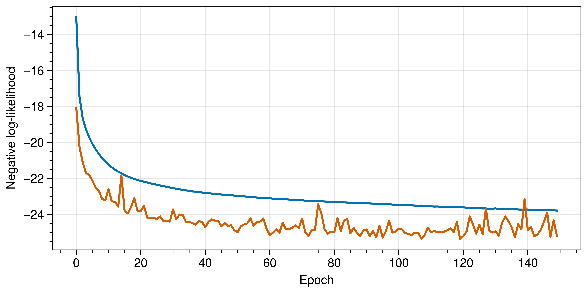
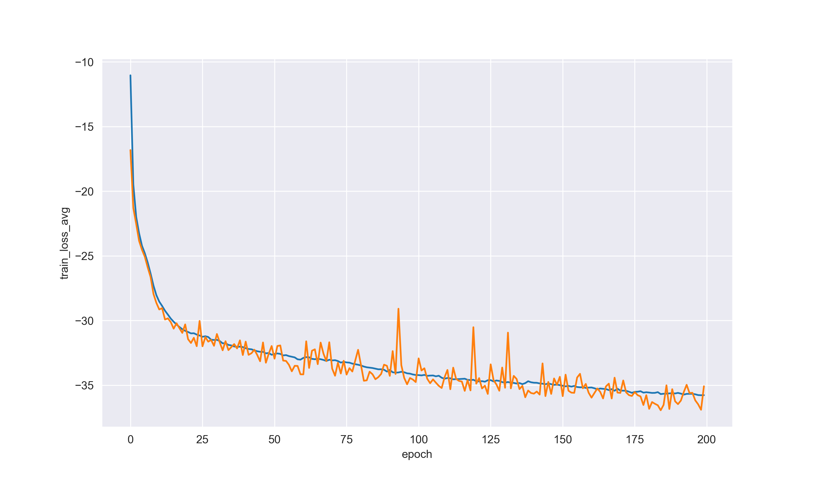
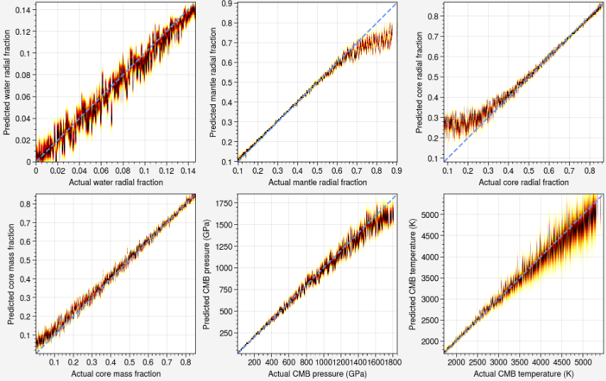

<a name="readme-top"></a>

<div align="center">


# DeepExo
</div>


Mixture density network using pytorch. Compared with the other implementation of MDN, this project using L2 and a couple of technique
instead of drop out layer to prevent the over fitting, this make the network more stably during training. This project is based on my tutor's [Rocky_Exoplanets_v2](https://github.com/VectorZhao/Rocky_Exoplanets_v2)

## Structure
1. This project using Elu in sigma layer for deal with the gradient disappear or explosion, at the same time, it is more
robust to noise than the tradition activate function 
    ```python
        self.root_layer = nn.Sequential(
            nn.Linear(self.i_s, self.n_h),
            nn.SiLU(),
            nn.Linear(self.n_h, self.n_h),
            nn.SiLU(),
            nn.Linear(self.n_h, self.n_h),
            nn.SiLU()
        ).double()
        
        self.pi = nn.Sequential(
            nn.Linear(self.n_h, self.n_h),
            nn.SiLU(),
            nn.Linear(self.n_h, self.n_g)
        ).double()
        
        self.mu = nn.Sequential(
            nn.Linear(self.n_h, self.n_h),
            nn.SiLU(),
            nn.Linear(self.n_h, self.o_s * self.n_g)
        ).double()
        
        self.sigma = nn.Sequential(
            nn.Linear(self.n_h, self.n_h),
            nn.ELU(),
            nn.Linear(self.n_h, self.o_s * self.n_g)
        ).double()
    ```
2. This project apply L2 normalization and a bit of technique such as xavier init, warmup to prevent the over fitting.
    ```python
        # Xavier Init
        init_weights(model)
        model = nn.DataParallel(model)
        model.to(self.device)\
        
        # L2
        optimizer = torch.optim.Adam(split_weights(model), lr=self.lr, weight_decay=self.w_d)
        
        # Warmup
        warmup = WarmUpLR(optimizer, len(t_l) * 5)
    ```

## Performance
|                 | Hidden Size | Number of Gaussian | Batch Size | Learning Rate | NLL Loss     | R2         | Mse        | Speed (Epoch)    |
|:----------------|:------------|:-------------------|:-----------|:--------------|:-------------|:-----------|:-----------|:-----------------|
| Without Dropout | 256         | 10                 | 1024       | 0.0001984     | **-33.7150** | **0.9950** | **0.0002** | **79**           |
| Dropout         | 512         | 20                 | 512        | 0.0001        | -25.1895     | 0.9929     | 0.0003     | 120              |


- Speed(Epoch): Because the final performance of Without Dropout MDN is better than the other one, recording the epoch when each model's R2 is 0.9929 can compare the training speed between MDN of Without Dropout and Dropout

Negative Likelihood Loss Function (Dropout)


Negative Likelihood Loss Function (Without Dropout)


Probability density distribution heat map(Dropout)


Probability density distribution heat map(Without Dropout)


   

## Example
This project's train part is based on the module [tortreinador](https://github.com/ArdenteX/tortreinador).

```python
from tortreinador import train
from tortreinador.models.MDN import mdn, Mixture, NLLLoss
import torch

input_parameters = [
    'Mass',
    'Radius',
    'Fe_(Mg+Si)',
    'k2',
]


output_parameters = [
    'WRF',
    'MRF',
    'CRF',
    'CMF',
    'PRS_CMB',
    'TEP_CMB',
]

# df_all is your dataset

trainer = train.TorchTrainer()
# Model
model = mdn(len(input_parameters), len(output_parameters), 10, 256)

# Loss
criterion = NLLLoss()
pdf = Mixture()

# Optimizer
optim = torch.optim.Adam(trainer.xavier_init(model), lr=0.0001984, weight_decay=0.001)

# You can specify the input/output parameter and your dataset(Only support Dataframe currently) 
t_loader, v_loader, test_x, test_y, s_x, s_y = trainer.load_data(data=df_all, input_parameters=input_parameters,
                                                                 output_parameters=output_parameters,
                                                                 if_normal=True, if_shuffle=True)

# The default optimizer is Adam
t_l, v_l, val_r2, train_r2, mse = trainer.fit_for_MDN(t_loader, v_loader, criterion, model=model, mixture=pdf,
                                                      model_save_path='D:\\Resource\\MDN\\', optim=optim, best_r2=0.5)
```

## Usage

Please visit [tortreinador](https://github.com/ArdenteX/tortreinador)
