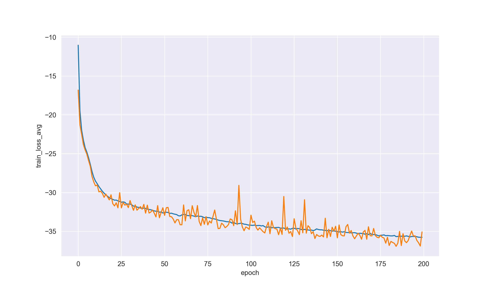
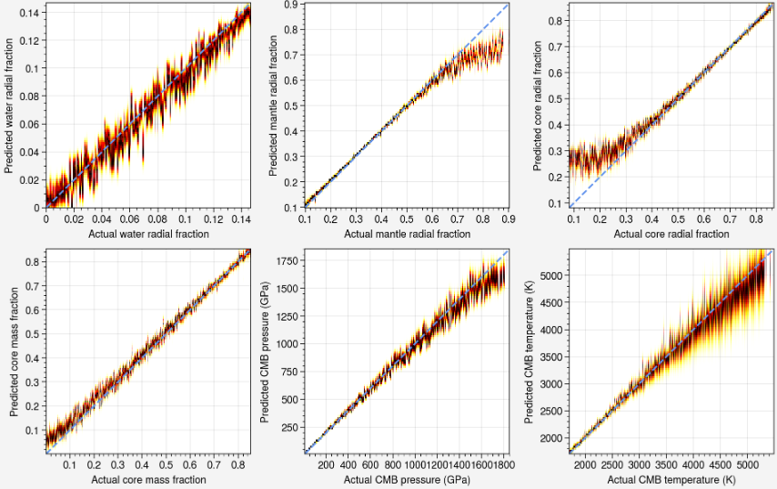

<a name="readme-top"></a>

<div align="center">


<h1 align="center">DeepExo</h1>

<b> 一键揭开系外行星内部之谜 </b>，

一个为行星科学提供的综合机器学习平台。

</div>

## 👋🏻 概览
使用 PyTorch 的混合密度网络。与其他 MDN 实现相比，此项目使用 L2 正则化和其他技术，而非 dropout 层来防止过拟合，使网络在训练期间更加稳定。该项目基于我导师的 [Rocky_Exoplanets_v2](https://github.com/VectorZhao/Rocky_Exoplanets_v2)
## ✨ 特性
- 🌐 统一项目集合：我们已精心整合了旨在预测[气态巨行星](https://github.com/VectorZhao/ExtrasolarGasGiants)和[岩石系外行星](https://github.com/VectorZhao/Rocky_Exoplanets_v2)内部结构的预先发布的机器学习模型。
- 🔧 尖端代码库：我们的项目经历了全面改造，实现了采用 PyTorch 的重新设计的代码架构。这次改革包括对像 MDN 层这样的核心组件的重新构想，使框架更加高效和可扩展。
- 📈 卓越的预测性能：利用我们改进后的代码库和重新训练的 MDN 模型，我们在预测能力上取得了实质性的增强。我们的模型一贯显示出优于前代模型的卓越性能，为行星科学研究提供更准确和可靠的结果。
- 🧩 封装功能：为了便于科学界的研究，我们开发了用户友好的封装功能。这些功能使研究人员能够轻松启动和训练自己用于探索系外行星内部的机器学习模型。这种抽象化简化了模型开发的复杂性，加速了科学探索。

## 🚀 开始使用

## 使用方法

请访问 [tortreinador](https://github.com/ArdenteX/tortreinador)

## 结构
1. 该项目在 sigma 层使用 Elu 激活函数以处理梯度消失或爆炸问题，同时比传统激活函数对噪声更加鲁棒。
    ```python
        self.root_layer = nn.Sequential(
            nn.Linear(self.i_s, self.n_h),
            nn.SiLU(),
            nn.Linear(self.n_h, self.n_h),
            nn.SiLU(),
            nn.Linear(self.n_h, self.n_h),
            nn.SiLU()
        ).double()
        
        self.pi = nn.Sequential(
            nn.Linear(self.n_h, self.n_h),
            nn.SiLU(),
            nn.Linear(self.n_h, self.n_g)
        ).double()
        
        self.mu = nn.Sequential(
            nn.Linear(self.n_h, self.n_h),
            nn.SiLU(),
            nn.Linear(self.n_h, self.o_s * self.n_g)
        ).double()
        
        self.sigma = nn.Sequential(
            nn.Linear(self.n_h, self.n_h),
            nn.ELU(),
            nn.Linear(self.n_h, self.o_s * self.n_g)
        ).double()
    ```
2. 该项目应用 L2 正则化和一些技术，比如 Xavier 初始化，热身（warmup）等，以防止过拟合。
    ```python
        # Xavier 初始化
        init_weights(model)
        model = nn.DataParallel(model)
        model.to(self.device)\
        
        # L2
        optimizer = torch.optim.Adam(split_weights(model), lr=self.lr, weight_decay=self.w_d)
        
        # 热身
        warmup = WarmUpLR(optimizer, len(t_l) * 5)
    ```

## 性能
|                 | 隐藏层大小 | 高斯数目 | 批量大小 | 学习率 | NLL 损失     | R2         | MSE        | 速度（Epoch）    |
|:----------------|:------------|:-------------------|:-----------|:--------------|:-------------|:-----------|:-----------|:-----------------|
| 无 Dropout | 256         | 10                 | 1024       | 0.0001984     | **-33.7150** | **0.9950** | **0.0002** | **79**           |
| 有 Dropout     | 512         | 20                 | 512        | 0.0001        | -25.1895     | 0.9929     | 0.0003     | 120              |


- 速度（Epoch）：因为无 Dropout MDN 的最终性能比另一个更好，记录下每个模型 R2 达到 0.9929 时的 Epoch 数，可以比较无 Dropout 和有 Dropout 的 MDN 训练速度。

负对数似然损失函数（有 Dropout）


负对数似然损失函数（无 Dropout）


概率密度分布热图（有 Dropout）


概率密度分布热图（无 Dropout）


## 示例
该项目的训练部分基于模块 [tortreinador](https://github.com/ArdenteX/tortreinador)。

```python
from tortreinador import train
from tortreinador.models.MDN import mdn, Mixture, NLLLoss
import torch

input_parameters = [
    'Mass',
    'Radius',
    'Fe_(Mg+Si)',
    'k2',
]


output_parameters = [
    'WRF',
    'MRF',
    'CRF',
    'CMF',
    'PRS_CMB',
    'TEP_CMB',
]

# df_all 是你的数据集

trainer = train.TorchTrainer()
# 模型
model = mdn(len(input_parameters), len(output_parameters), 10, 256)

# 损失函数
criterion = NLLLoss()
pdf = Mixture()

# 优化器
optim = torch.optim.Adam(trainer.xavier_init(model), lr=0.0001984, weight_decay=0.001)

# 你可以指定输入/输出参数和你的数据集（当前仅支持 Dataframe）
t_loader, v_loader, test_x, test_y, s_x, s_y = trainer.load_data(data=df_all, input_parameters=input_parameters,
                                                                 output_parameters=output_parameters,
                                                                 if_normal=True, if_shuffle=True)

# 默认的优化器是 Adam
t_l, v_l, val_r2, train_r2, mse = trainer.fit_for_MDN(
    t_loader, v_loader, criterion, model=model, mixture=pdf,
    model_save_path='D:\\Resource\\MDN\\', optim=optim, best_r2=0.5)
```

## 📚 References
- [Machine learning techniques in studies of the interior structure of rocky exoplanets](https://www.aanda.org/articles/aa/abs/2021/06/aa40375-21/aa40375-21.html)
- [Understanding the interior structure of gaseous giant exoplanets with machine learning techniques](https://www.aanda.org/articles/aa/abs/2022/02/aa42874-21/aa42874-21.html)
- [Machine-learning Inferences of the Interior Structure of Rocky Exoplanets from Bulk Observational Constraints](https://iopscience.iop.org/article/10.3847/1538-4365/acf31a)
